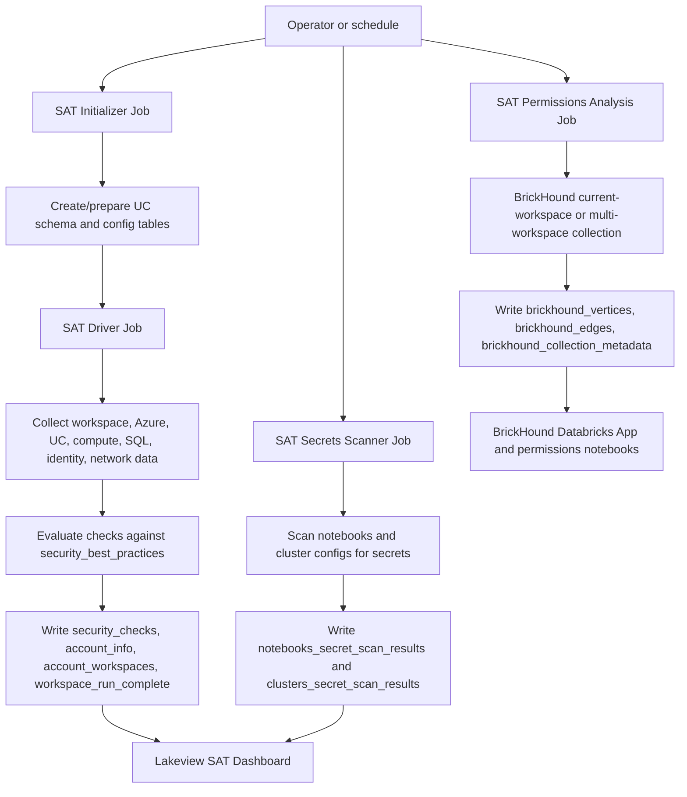

# Databricks SAT Architecture And Analysis Guide

This document explains what Databricks Security Analysis Tool (SAT) is, how it is deployed in this workspace, what components it creates, how execution flows, and what analysis appears in the SAT dashboard and BrickHound permissions analysis.

## 1. What Is SAT?

Databricks Security Analysis Tool (SAT) is a Databricks solution accelerator that analyzes Databricks account, workspace, Unity Catalog, compute, network, identity, governance, and data protection configuration. It writes findings into Unity Catalog Delta tables and publishes a Databricks Lakeview dashboard for review.

SAT is not an enforcement product. It is an assessment and reporting tool. It collects configuration and permission data, evaluates that data against Databricks security best practices, and shows pass/deviation status with remediation guidance.

Use these placeholders for a concrete deployment:

- Local project: `<local-sat-project>/security-analysis-tool`
- Workspace files: `/Workspace/Applications/SAT/files`
- Analysis catalog/schema: `<catalog>.<schema>`
- Workspace profile: `<workspace-profile>`
- Workspace ID: `<workspace-id>`
- Workspace URL: `<workspace-host>`

## 2. What Are The Benefits SAT Provides?

SAT gives teams a repeatable way to understand and track Databricks security posture without manually checking every workspace setting, Unity Catalog object, policy, permission, and cloud resource configuration.

Key benefits:

| Benefit | What SAT Provides |
| --- | --- |
| Centralized security posture | A Lakeview dashboard that summarizes pass/deviation status across enabled Databricks security best-practice checks. |
| Repeatable assessments | Scheduled jobs that rerun the same checks over time, making posture drift easier to spot. |
| Governance visibility | Governance checks for workspace settings, Unity Catalog posture, jobs, policies, and administrative controls. |
| Identity and access visibility | Workspace-level visibility into users, groups, service principals, admins, tokens, and permissions that are available through workspace APIs. |
| Data protection checks | Findings related to encryption, secret handling, DBFS/storage usage, credentials, and data controls. |
| Network security checks | Visibility into network posture, private connectivity, egress, and related workspace or cloud network configuration where APIs expose it. |
| Secrets exposure detection | Notebook and cluster configuration scanning for exposed secrets, with clean-scan handling when no findings exist. |
| Permissions graph analysis | BrickHound graph tables and notebooks for questions like who can access what, which groups grant access, and where privilege escalation paths may exist. |
| Evidence tables | Delta tables in Unity Catalog that keep raw findings, check metadata, run status, secret scan results, and BrickHound graph data queryable by SQL. |
| Operational handoff | Deployed Databricks Jobs, dashboards, and app resources make the assessment repeatable for platform, security, and governance teams. |
| Flexible setup modes | Workspace-only mode works without Databricks account admin API; full account mode adds account-level identities, assignments, and multi-workspace context. |

SAT is most useful as an assessment and observability layer. It highlights risk areas and gives remediation guidance, but it does not automatically enforce controls or replace platform governance processes.

## 3. Architecture And Execution Flow

SAT uses Databricks Asset Bundles, Databricks Jobs, notebooks, Unity Catalog Delta tables, Lakeview dashboards, and an optional Databricks App for BrickHound permissions analysis.

### Components Created During Setup

| Component | Current value | Purpose |
| --- | --- | --- |
| Unity Catalog catalog/schema | `<catalog>.<schema>` | Stores SAT result tables and BrickHound graph tables. |
| SAT Lakeview dashboard | `Security Analysis Tool [SAT]`, dashboard ID `<dashboard-id>` | Main visual report for checks, governance, secrets, and security posture. |
| SQL warehouse | `test`, warehouse ID `<warehouse-id>` | Executes dashboard and validation queries. |
| Workspace files | `/Workspace/Applications/SAT/files` | Deployed notebooks, dashboard template, app source, and bundle files. |
| Initializer job | `<initializer-job-id>` | One-time setup of SAT tables/config/dashboard. |
| Driver job | `<driver-job-id>` | Main scheduled SAT security analysis. |
| Secrets scanner job | `<secrets-scanner-job-id>` | Scans notebook and cluster configuration content for secrets. |
| Permissions analysis job | `<permissions-analysis-job-id>` | Runs BrickHound graph collection for permissions analysis. |
| Databricks App | `<brickhound-app-name>` | Hosts BrickHound UI for graph exploration. |
| App URL | `<brickhound-app-url>` | Browser UI for permissions graph exploration. |
| Azure app registration | `<azure-app-registration-name>` | Lets SAT inspect Azure Databricks resource configuration through Azure APIs. |
| Databricks workspace service principal | Databricks SP ID `<databricks-service-principal-id>` | Service principal added to workspace admins for SAT checks. |

### Main Data Tables

| Table | Purpose |
| --- | --- |
| `security_best_practices` | Static or configured list of checks, categories, severity, recommendations, docs, and logic. |
| `security_checks` | Per-run check results. `score = 0` means pass; nonzero means deviation. |
| `account_info` | Workspace/account-level facts collected during SAT runs. |
| `account_workspaces` | Workspaces included in analysis. In workspace-only mode this can contain just the current workspace. |
| `workspace_run_complete` | Run completion tracking by workspace/date/run. |
| `notebooks_secret_scan_results` | Notebook secret scan result rows. Clean scans can have sentinel rows with `secrets_found = 0`. |
| `clusters_secret_scan_results` | Cluster secret scan result rows. Clean scans can have sentinel rows with `secrets_found = 0`. |
| `brickhound_vertices` | Graph nodes: users, groups, service principals, jobs, clusters, catalogs, schemas, tables, secrets, warehouses, dashboards, apps, etc. |
| `brickhound_edges` | Graph relationships and permissions: membership, ownership, contains, UC privileges, workspace object permissions, secret access. |
| `brickhound_collection_metadata` | One row per BrickHound collection run with mode, timestamp, counts, collected workspace, and failures. |

### Execution Order

Run SAT jobs sequentially on first setup:

1. SAT Initializer Notebook, one time.
2. SAT Driver Notebook.
3. SAT Secrets Scanner.
4. SAT Permissions Analysis - Data Collection.

Avoid running Driver and Permissions Analysis concurrently during the first run. We previously saw a Delta metadata collision when first-run jobs ran at the same time.

## 4. What Analysis The Report Shows

SAT separates the main report into best-practice categories. Each check belongs to a category and severity. The dashboard summarizes total checks, pass/deviation counts, severity, workspace, and run date.

### Report Categories

| Category | What it covers |
| --- | --- |
| Data Protection | Encryption, storage, DBFS usage, secret handling, credentials, table/data controls. |
| Governance | Unity Catalog configuration, workspace settings, admin controls, jobs-as-service-principal practices, policies, auditability, feature configuration. |
| Identity & Access | Users, groups, admins, tokens, service principals, identity permissions visible from workspace APIs. |
| Network Security | Private link, network policies, secure connectivity, egress, serverless/network settings where visible. |
| Informational | Facts and context that may not be direct failures but help explain environment posture. |

### Check Summary

The SAT dashboard summarizes the latest driver result from `<catalog>.<schema>`:

| Category | Checks | Passed | Deviations |
| --- | ---: | ---: | ---: |
| Data Protection | `<count>` | `<count>` | `<count>` |
| Governance | `<count>` | `<count>` | `<count>` |
| Identity & Access | `<count>` | `<count>` | `<count>` |
| Informational | `<count>` | `<count>` | `<count>` |
| Network Security | `<count>` | `<count>` | `<count>` |

The exact counts depend on the SAT version, enabled checks, cloud, and workspace configuration.

### Secrets Analysis

The Secrets Scanner scans:

- Notebook content.
- Cluster configuration fields.

In this workspace, the scanner completed and wrote rows to:

- `clusters_secret_scan_results`
- `notebooks_secret_scan_results`

The current result is a clean scan with zero actual secret findings. Some detailed secret tables or tiles can still show no rows because there are no findings to list. The summary counters should show zero, not fail as missing data.

## 5. Permissions Analysis With BrickHound

BrickHound complements SAT by collecting a graph of principals, resources, relationships, and permissions. It answers questions like:

- Who can access a resource?
- What resources can a principal access?
- Which permissions are direct versus group-inherited?
- Which groups or principals have powerful permissions?
- Are there possible privilege escalation or impersonation paths?

### BrickHound Tables

A successful workspace-only BrickHound collection produces rows in these tables:

| Table | Current rows |
| --- | ---: |
| `brickhound_vertices` | `<count>` |
| `brickhound_edges` | `<count>` |
| `brickhound_collection_metadata` | `<count>` |

The latest confirmed run mode was `single-workspace`, with the current workspace host recorded in collection metadata.

### Current Top Vertex Types

| Vertex type | Meaning |
| --- | --- |
| View | Unity Catalog views. |
| Table | Unity Catalog tables. |
| Schema | Unity Catalog schemas. |
| ServingEndpoint | Model serving endpoints. |
| Catalog | Unity Catalog catalogs. |
| Secret | Secrets found in secret scopes metadata. |
| ClusterPolicy | Cluster policy objects. |
| Group | Workspace groups. |
| Job | Databricks Jobs. |
| ServicePrincipal | Workspace service principals. |
| Dashboard | Lakeview dashboards. |
| User | Workspace users. |
| Warehouse | SQL warehouses. |
| App | Databricks Apps. |
| SecretScope | Secret scopes. |

### Current Top Relationship Types

| Relationship | Meaning |
| --- | --- |
| `Contains` | Structural relationship, such as catalog contains schema, schema contains table. |
| `SELECT` | UC select privilege. |
| `ALL PRIVILEGES` | UC all privileges grant. |
| `MANAGE` | Manage permission on object. |
| `USE SCHEMA` | UC schema usage privilege. |
| `BROWSE` | UC browse privilege. |
| `EXECUTE` | Function/model execution privilege. |
| `READ VOLUME` | UC volume read privilege. |
| `USE CATALOG` | UC catalog usage privilege. |
| `MemberOf` | Principal-to-group membership. |
| `CAN_USE`, `CAN_MANAGE`, `IS_OWNER` | Workspace object permissions. |
| `CanManageSecret`, `CanReadSecret` | Secret-scope access relationships. |

### BrickHound Analysis Notebooks

SAT deploys BrickHound notebooks for deeper analysis:

| Notebook | Purpose |
| --- | --- |
| `01_principal_resource_analysis.py` | Principal/resource lookup: who can access what. |
| `02_escalation_paths.py` | Privilege escalation path analysis. |
| `03_impersonation_analysis.py` | Impersonation risk analysis. |
| `04_advanced_reports.py` | Compliance-oriented permission reports. |

## 6. Two Setup Approaches

SAT can be operated in two valid modes.

### Approach A: Workspace-Only Setup

Use this when:

- You have Databricks workspace admin access.
- You have Azure Reader access through an Azure app registration.
- You do not have Databricks account admin API access.
- You need security posture for the current workspace.

Works well for:

- Core SAT dashboard.
- Governance summary.
- Workspace settings, compute, jobs, warehouses, UC objects visible to the workspace.
- Secrets scanner.
- BrickHound single-workspace graph.

Limitations:

- No account-level SCIM users/groups/service principals.
- No account workspace assignments.
- No account-level metastore listing or assignment graph.
- No complete multi-workspace graph.
- Cross-workspace attack paths and account-admin relationships can be incomplete.

This is the expected mode when account API access is not available.

### Approach B: Full Account API Setup

Use this when:

- You have Databricks account admin access, or a service principal with account-level permissions.
- You need all workspaces in the account.
- You need account identity graph data.
- You need workspace assignments and account-level Unity Catalog/metastore relationships.
- You need fuller cross-workspace permission and attack-path analysis.

Additional capabilities:

- Account users, groups, service principals.
- Workspace assignment relationships.
- Account metastores and assignments.
- Multi-workspace BrickHound collection.
- More complete account-level graph and permission paths.

For Azure Databricks, a workspace profile pointed at `https://adb-...azuredatabricks.net` is not enough for account APIs. Account API validation must use `https://accounts.azuredatabricks.net` plus `account_id`.

## 7. Current Workspace Status

After a successful workspace-only deployment:

- Workspace-only SAT is working.
- Core SAT tables are populated.
- Secrets scanner completed with zero actual findings.
- BrickHound single-workspace permissions analysis completed successfully.
- Account API may remain unavailable from the workspace profile. In that case, account-level commands can return errors such as `Not Found` or `Unable to load OAuth Config`.

Account API is not blocking the current workspace SAT dashboard. It only limits account-level and multi-workspace analysis.
